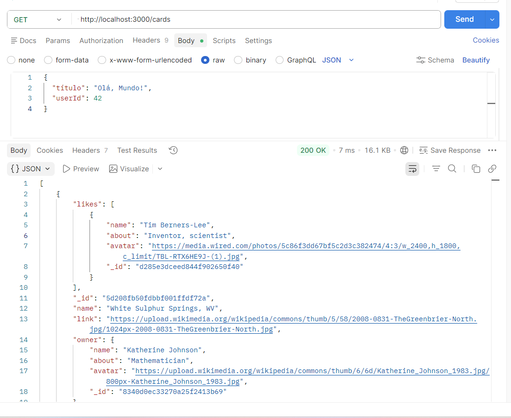
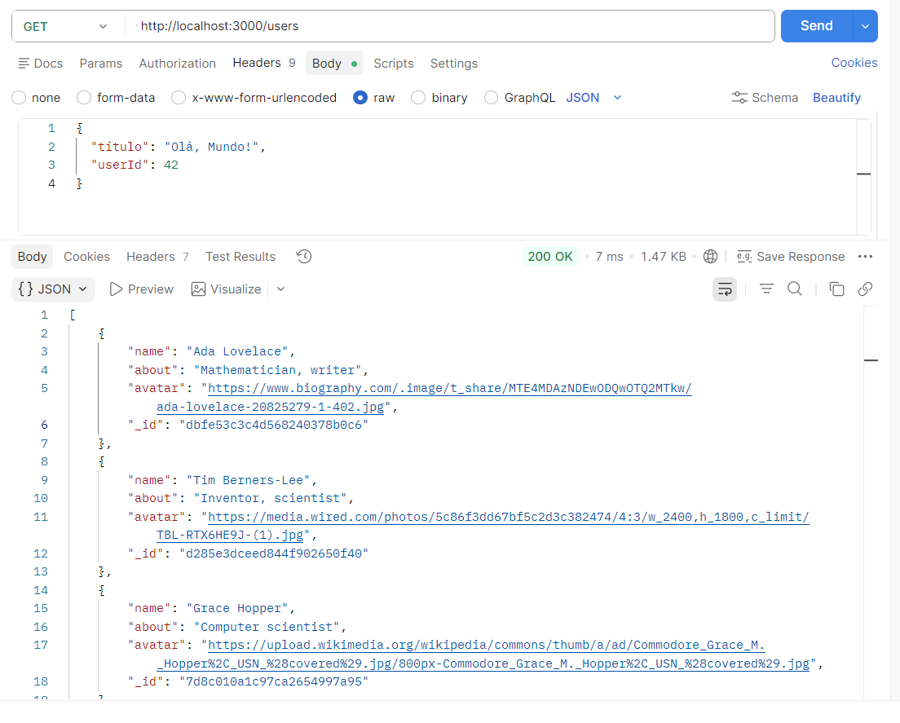
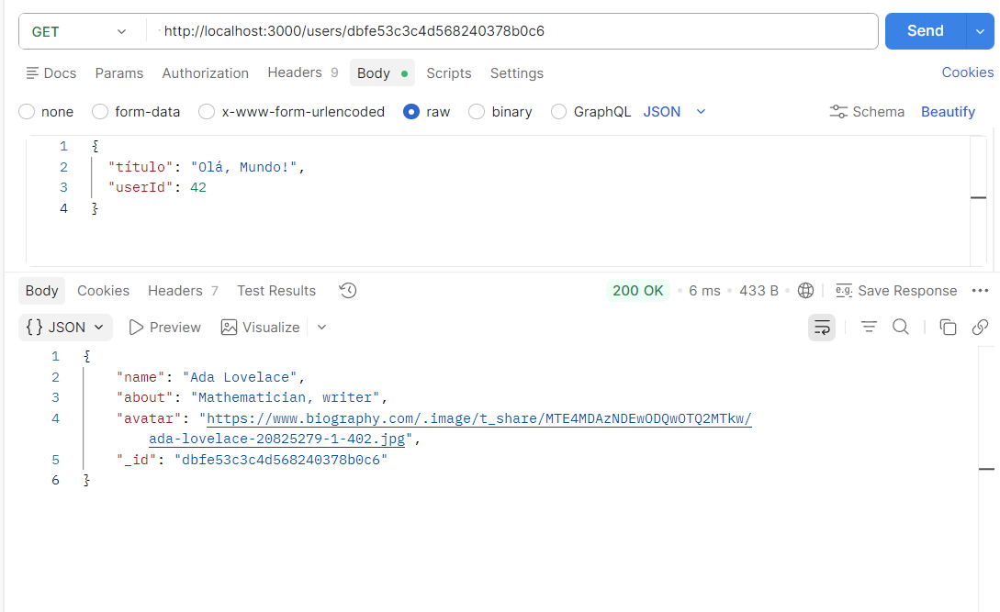
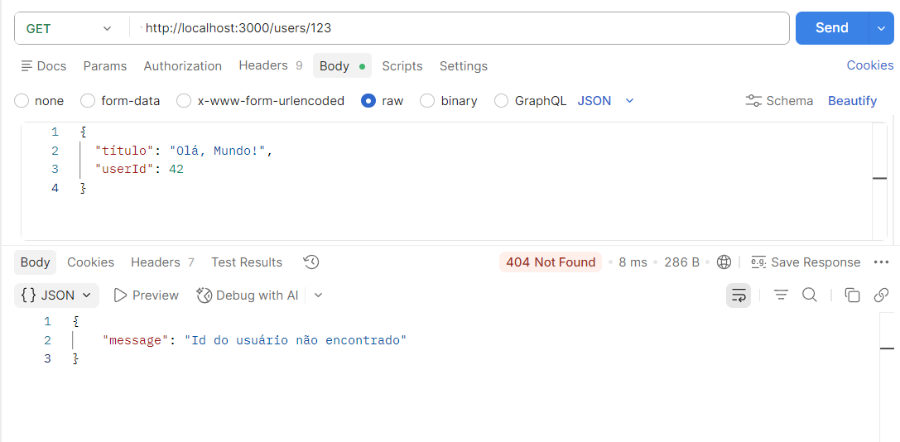

# Tripleten web_project_around_express

Projeto 15 da Tripleten WEB
data: 16/04/2026

1 - Node.js
O Node.js é o ambiente de execução que permite rodar código JavaScript no lado do servidor. Escolhido por sua alta escalabilidade e pelo enorme ecossistema de pacotes (NPM).

2 - Express.js
O Express é o framework web para Node.js. Ele simplifica a criação de rotas, o gerenciamento de requisições HTTP (GET, POST, etc.) e o uso de middlewares, tornando o código mais organizado e fácil de manter.

3 - fs - readFile()
Módulo nativo do Node.js usado para interagir com o sistema de arquivos do computador. Utilizamos a versão com Promises para realizar leituras de arquivos JSON de forma assíncrona, evitando que o servidor trave enquanto lê os dados.

4 - Path
Módulo utilitário do Node.js para manipular caminhos de arquivos e diretórios. Ele garante que a aplicação funcione corretamente tanto em Windows quanto em Linux/Mac, resolvendo problemas de barras invertidas e diretórios relativos.

5 - Postman
Ferramenta de interface gráfica utilizada para testar as rotas da API. Com ele, simulamos as requisições do Front-end antes mesmo de termos a interface pronta, garantindo que o Backend está enviando os dados e status codes (200, 404, 500) corretos.

6 - Testes da API
Abaixo, os resultados dos testes realizados no 'Postman':

Listagem de cards (GET /cards)

Listagem de Usuários (GET /users)

Busca por ID (GET /users/:id)

Busca por ID não existente (GET /users/:id)

Projeto 16 da Tripleten WEB
data: 21/05/2026

Around Express - Backend API

1 - API REST desenvolvida com Node.js, Express e MongoDB, responsável pelo gerenciamento de usuários e cartões, incluindo curtidas, atualização de perfil e manipulação de dados persistidos no banco.

2 - Tecnologias Utilizadas:
Node.js
Express
MongoDB
Mongoose
JavaScript (ES6+)

3 - Funcionalidades:
Usuários
Criar usuário
Buscar todos os usuários
Buscar usuário por ID
Atualizar perfil
Atualizar avatar

4 - Cartões
Criar cartão
Listar cartões
Deletar cartão
Curtir cartão
Remover curtida

5 - Banco de Dados - Conexão MongoDB:

mongodb://localhost:27017/aroundb

Banco utilizado:

aroundb

6 - Validação de URL

Os campos avatar e link utilizam validação com Expressão Regular (RegEx) para garantir URLs válidas:

Exemplos aceitos:

https://example.com
http://www.example.com
http://example.com/image.png

7 - Tratamento de Erros

Código Descrição
400 Dados inválidos
404 Usuário ou cartão não encontrado
500 Erro interno do servidor

Uso de:
err.name

.orFail()

Middleware centralizado de erros

8 - Aprendizados

Este projeto aborda conceitos importantes de backend como:

Arquitetura REST
CRUD completo
Modelagem MongoDB
Relacionamento entre documentos
Middleware
Validação de dados
Tratamento de erros
Organização em MVC
